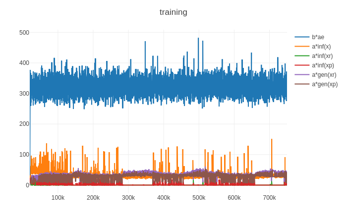
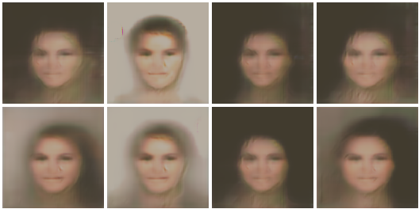

# IntroVAE-Pytorch

Pytorch Implementation for NeuraIPS2018 paper: 
[IntroVAE: Introspective Variational Autoencoders for Photographic Image Synthesis](https://arxiv.org/abs/1807.06358).

The rep. contains a basic implementation for IntroVAE. However, due to no official implementation released, some hyperparameters can only be guessed and can not reach the performance as stated in paper.


# HowTo
1. Download [CelebA](http://mmlab.ie.cuhk.edu.hk/projects/CelebA.html) dataset and extract it as:
```
├── /home/i/dbs/
	├──img_align_celeba # only one folder in this directory
		├── 050939.jpg
		├── 050940.jpg
		├── 050941.jpg
		├── 050942.jpg
		├── 050943.jpg
		├── 050944.jpg
		├── 050945.jpg
```

modify `/home/i/dbs` to your specific path, making sure that the `/home/i/dbs/` comtains only ONE folder since we use
`torchvision.datasets.ImageFolder` API to load dataset. 
```python
    argparser.add_argument('--root', type=str, default='/home/i/dbs/',
                           help='root/label/*.jpg')
```

2. run `python main.py  --epoch 750000` to train from strach, and use `python main.py --resume '' --epoch 1000000` to resume training from latest checkpoint.


# Training

only tested for CelebA 128x128 exp.

- training curves


- sampled x


